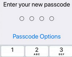
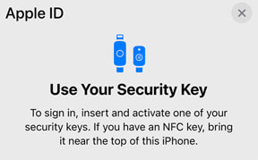

# iPhone Security

Practical guide to better understand the iPhone and its vulnerabilities.


## ⚠️ Disclaimer

This guide is meant for **iOS 16 and later versions**.

## What is the iPhone?

The first [iPhone](https://support.apple.com/guide/iphone/welcome/ios) was released in June 2007.

It is one of the best selling products of all time, at least, in Tech. This little smartphone has changed pretty much everything in the industry and is probably the cornerstone of Apple's empire.

## What is iOS?

Apple has developed iOS for its iPhone and a few other products. Unlike Android, it's not an open-source project and only Apple can modify and distribute it.

However, let's skip the debate "iOS vs. Android, which one is better" that is totally off-topic here.

iOS supports a wide range of features, from facial recognition to mobile payments and many other services. It's also composed of specific security layers.

## Face ID vs. Passcodes vs. Apple Watch vs. usability

### Use Alphanumeric Passcodes, not digits



Passcodes allow you to lock your iPhone with a 4 or 6-digit password, but it's a weak password by nature. You don't have to stick with the default option and can use a much much stronger passcode:

Settings > Face ID & Passcode > Change Passcode > Passcode Options > Custom Alphanumeric Code

If someone looks at you when you're unlocking your phone, which is not unlikely (e.g., in a bar, public transports, etc), it's not very complicated to deduce what you're typing and remember a few digits, but a long and random password is way harder to catch.

### Face ID might fail

The above solution is fine but not realistic if you are a standard user. People touch their phone all day long, so if you have to type a very complicated password again and again, it could ruin your experience.

That's probably why passcode options are not easy to find for the average eager user (very small unstyled hyperlink instead of a stylish button).

Besides, Apple provides a feature called Face ID, which consists of scanning your face and use it as biometric authentication factor, so you can unlock your iPhone and access many features simply by showing your face to the camera.

That's cool but in real-world conditions, especially in public places, Face ID tend to fail (many users have reported it), so the interface may often ask the passcode as a fallback.

### Face ID with a Mask

You need **at least an iPhone 12** to get that functionality. Models prior to that version won't have it.

Apple shows an explicit message for users who might worry about potential privacy issues with Face ID. In short, it says that your biometric data never leave the phone (e.g., no iCloud sync) and you can disable Face ID at any time.

Recent models (at the time of writing) support an additional feature called "Face ID with a Mask": Settings > Face ID & Passcode > Face ID with a Mask. When enabled, the phone checks the physical details around the human eyes instead of the full face, allowing users to wear a mask when using Face ID.

Some people might think it's a good idea, but I'm not sure of the benefits for privacy, and, in a security perspective, I would not recommend it. By definition, the face recognition is less accurate.

### Don't disable Attention for Face ID

This is the most shocking setting, to me, as users can disable attention for Face ID: Settings > Face ID & Passcode > Require Attention for Face ID.

In other words, the phone can look at your face and skip your eyes! Apple calls that scanning "an additional level of security," but it seems critical. The scan might pass when you're sleeping...

Never disable this setting if you plan to use Face ID.

### Don't unlock with an Apple Watch

Again, this feature is limited to the most recent models at the time of writing, but it seems hazardous in terms of security.

Settings > Face ID & Passcode > Unlock with Apple Watch

Users can unlock their iPhone with their Apple Watch. What a mess! There are so many credible scenarios where an attacker might leverage such configuration. Just don't use it.

## iOS 16: a quick review

### iPhone models compatible with iOS 16

[Get the official list](https://support.apple.com/guide/iphone/supported-models-iphe3fa5df43/ios)

### The security content of iOS 16.3

[Read HT213606](https://support.apple.com/en-us/HT213606)

### The security content of iOS 16.3.1

[Read HT213635](https://support.apple.com/en-gb/HT213635) 

### Apple security updates

[Read HT201222](https://support.apple.com/en-us/HT201222)

### Notable iOS 16 security features

Beyond Face ID and other popular settings, iOS 16 provides interesting new security features:

* **Rapid Security Response**: you can activate an option to install security hotfixes automatically as soon as it's released
* **Safety Check**: shared access can be removed easily with an "emergency reset"
* **protected clipboard**: apps cannot access the clipboard without your explicit permission
* [**security keys for Apple ID**](https://support.apple.com/en-us/HT213154) (iOS 16.3)
* **hidden and recently deleted albums require authentication**: via Face ID or passcode

### The potential benefits of an opaque system

As long as users don't make crazy moves, like **jailbreaking** to install untrusted apps, the system will be hard to fool.

Apple controls the devices but also third-party applications. For now, these Apps must obtain the App Store approval, which is a very strict process that can require important modifications.

This approach has some cons we'll see later, but such limited ecosystem allows supporting older devices a bit longer.

Besides, iOS has a built-in sandboxing mechanism that restricts apps to specific resources and data, and the system encrypts passwords and other sensitive information automatically.

This tends to make classic attacks more challenging. Besides, Apple enables many advanced security features by default, unlike other systems.

### iOS 16 Lockdown Mode

[The LockDown mode](https://support.apple.com/en-us/HT212650) is marketed as an "extreme protection" for individuals who might be targeted by very sophisticated adversaries.

When enabled, the surface attack is drastically reduced to the point that some features may no longer work:

* most message attachments are blocked
* links and link previews are disabled
* explicit approval is required to unlock accessories or connected computers
* shared Albums are hidden and disabled
* web browsing technology is restricted

Indeed, the LockDown mode is not meant for everybody, but Apple seems to target high-risk profiles, a.k.a non-standard users with a specific threat model, like activists, journalists, or even political dissidents.

PortSwigger [reported](https://portswigger.net/daily-swig/lockdown-mode-apple-offers-2m-bug-bounty-for-vulnerabilities-in-new-anti-spyware-tech) that Apple has offered a huge reward (up to $2m!) for a working LockdDown Mode bypass.

The company is targeting mercernary enterprises like NSO that successfully defeated the so-called "unbreakable" iPhone in the past (e.g., with the Pegasus software).

However, these sophisticated actors are constantly working on new exploits, and can leverage _alternative_ markets for iOS zero-days and zero-click exploits [^1].

While the LockDown mode is undeniably restrictive, it cannot cover all vulnerabilities.

[^1]: 0-days are vulnerabilities that remain unknown or unpatched by those who should be interested in their mitigation (e.g., vendors, developers), and zero-click attacks often leverage 0-days to infect the victims without any user interaction.

### iOS is not exactly Wonderland

Apple aims to bring war to advanced attackers but may create the perfect conditions for them: it might be harder for inexperienced criminals to attack, but defenders and security researchers might also fail to detect and mitigate advanced threats.

Many security researchers struggle to find relevant documentation for important components and some compare Apple's products to "black boxes."

Another big caveat is that iOS users are tied to Apple _de facto_. If the company misses a critical vulnerability or makes some bad decisions, there's very little, perhaps nothing users can do about it.

### The latest versions are not immune to attacks

Trellix researcher Austin Emmitt recently discovered new vulnerabilities and declared:

> [These new vulnerabilities] represent a significant breach of the security model of macOS and iOS which relies on individual applications having fine-grained access to the subset of resources they need and querying higher privileged services to get anything else

[Source: Hackernews](https://thehackernews.com/2023/02/apple-warns-of-3-new-vulnerabilities.html)

## How to secure iPhones

### Personas

#### What is a persona?

Internet defines personas as digital representations of individuals or entities. These are not real persons but typical profiles that are widely used in marketing but also in other fields, such as cybersecurity.

#### Meet Sarah & Enzo (experimental)

Sarah:

```
Name: Sarah
Age: 35
Occupation: iOS dev
Location: San Francisco, CA

Personality:
    Analytical
    Tech-savvy
    Cybersecurity-aware
    Problem solver
    Persistent
    Curious

Device: iPhone 13 Pro Max

Usage:
    Uses her iPhone for work and personal communication
    Uses a 6-digit passcode
    Uses various apps to access work-related data
    Frequently travels for work and uses iPhone for navigation, booking hotels, and other related activities
```

Enzo:

```
Name: Enzo
Age: 50
Occupation: Sales Manager

Location: New York City, NY

Personality:
    Business-oriented
    Trusting
    Non-technical
    Relies on others for technical support
    Time-poor
    Values convenience

Device: iPhone 12

Usage:
    Uses iPhone to make payments, including for business expenses
    Uses iPhone to access work email and schedule appointments
    Uses iPhone to store business contacts and important information
    Does not regularly update his iPhone's software or take other security precautions
    Frequently travels for work and uses iPhone for navigation, booking hotels, and other related activities
```

Both Sarah and Enzo are not safe. Enzo should be more concerned, but Sarah should not rely on basic passcodes to secure her phone. An attacker could look over her shoulder and steal her phone.

Such scenario is credible and criminals can use the stolen iPhone to change passcodes and lock her out of many other connected accounts. It can be achieved in a few minutes or less, especially if she stores her passwords in the built-in password manager to speed up authentication.

The potential victim could leverage the privacy and security checklists of these guide (next part), but none of them will enable the LockDown Mode, and even they do, this "extreme" configuration does not prevent users from using very weak passcodes...

### iPhone privacy checklist

You can opt out of various telemetries during the first install, but in case you missed it, here are some reminders:

- [x] disable "Privacy preserving ad measurement" (Settings > Safari > Privacy preserving ad measurement), which is a misleading setting
- [x] disable "Check for Apple Pay" (Settings > Safari > Check for Apple Pay)
- [x] set "deny," or, at least, "ask" in "Settings for websites" in Safari (Settings > Safari > Settings for websites: location, microphone, etc)
- [x] disable all Siri options if you don't need Siri (Settings > Siri & Search)
- [x] disable analytics (Settings > Analytics & Improvments)
- [x] disable Apple ads (Settings > Apple Advertising > Personalized Ads)
- [x] remove unused Apps, including pre-packaged apps like "Weather" or "TV"
- [x] disable fitness tracking (Settings > Motion & Fitness > Fitness tracking)
- [x] disable location tracking (Settings > Privacy and Security > Location Services)
- [x] disable app tracking (Settings > Privacy and Security > Tracking > Allow Apps to Request to Track)
- [x] hide your IP from trackers in Safari (Settings > Safari > Hide IP Address)
- [x] restrict app access to your local network (Settings > Privacy and Security > Local Network)
- [x] add a [camera cover](https://www.amazon.com/iphone-case-camera-cover/s?k=iphone+case+camera+cover)

Apple lets you review app permissions with some granularity, so do it regularly: Settings > Privacy and Security. Unfortunately, it's a bit time-consuming, as you'll probably have to review each app, one by one, but it's worth it.

Tracking is not free in terms of privacy, but also for the battery. It can literally drain your power, so only enable it when it's necessary, and you don't have to give a permanent access.

### iPhone security checklist

- [x] **don't** Jailbreak (unless you run the system as a security researcher or an iOS developer, but be aware of the consequences)
- [x] don't disable Attention for Face ID
- [x] don't allow your iPhone to be unlocked by your Apple Watch
- [x] enable automatic updates and security hotfixes (Settings > General > Software Update > Automatic Updates)
- [x] keep all apps up-to-date
- [x] use an Alphanumeric Passcode instead of digits (Settings > Face ID & Passcode > Change Passcode > Passcode Options > Custom Alphanumeric Code)
- [x] turn on **encryption for iCloud backups** (requires security keys)
- [x] disable **all** options for lock screen (Settings > Face ID & Passcode > Allow access when locked)
- [x] use a third-party password manager (e.g., 1P)
- [x] if the third-party password manager does not disable the built-in one uncheck it: Settings > Passwords > Password Options > AutoFill Passwords
- [x] don't click on links in unsollicited messages
- [x] review app permissions (Settings > Privacy and Security)
- [x] review third-party apps carefully **before** installing them: look at the ratings, the number of downloads, etc
- [x] use a strong Apple ID password and change it regularly
- [x] remove unused Apps
- [x] filter unknown senders (Settings > Messages > Filter Unknown Senders)
- [x] disable Bluetooth if you don't need it (Settings > Bluetooth)
- [x] don't stay in Bluetooth settings (Settings > Bluetooth) while it's enabled, as your device is in discoverable mode
- [x] disable WiFi if you don't need it (Settings > WiFi)
- [x] disable WiFi auto-join networks and hostspots (Settings > WiFi)
- [x] disable AirDrop if you don't need it (Settings > General > AirDrop)
- [x] disable automatic discover to nearby AirPlay if you don't need it (Settings > General > AirPlay & Handoff > Automatically AirPlay to TV)
- [x] auto-lock the screen (Settings > Display & Brightness > Auto-Lock)

### In doubt

⚠️ Some of the following measures might be either extreme or insufficient, or even inappropriate for your threat model:

- [x] remove Face ID or Touch ID completely
- [x] run a "Safety check" (Settings > Privacy and Security > Safety Check)
- [x] inspect the battery health and activity (Settings > Battery)
- [x] delete credit cards and other payments (Settings > Wallet & Apple Pay)
- [x] use CarPlay only in USB mode and not Bluetooth (wireless) to avoid Car Whisperer attacks (Settings > General > CarPlay)
- [ ] cover your screen when entering your passcode in public
- [ ] switch to Airplane mode
- [ ] use hardwarde security keys for your Apple ID (see https://support.apple.com/en-us/HT213154)
- [ ] use [Signal](https://apps.apple.com/us/app/signal-private-messenger/id874139669)
- [ ] enable anti brute-force: erase data after 10 failed passcode attempts (Settings > Face ID & Passcode > Erase Data) [^2]
- [ ] run a factory reset (Settings > General > Reset > Erase all content and settings)
- [ ] enable [LockDown Mode](#ios-16-lockdown-mode) (Settings > Privacy and Security > LockDown Mode)

[^2]: ensure you backup your data regularly (e.g., using iCloud) if you enable this option

## About hardware security keys



Most phishing attacks against Apple IDs aim to steal credentials remotely, and OTP codes (One-Time passwords) can be stolen with SIM jacking or SIM swapping. 

Simple old classic theft can also do the job, as the iPhone holds the authentication factor. Now if you enable security keys, which are physical devices that may look like USB drives or NFC accessories, this is not the same story.

You will have to set 2 keys in the settings, as Apple requires an emergency key in case you lose the first one, but it's quite straightforward.

## Best free Apps

- [x] Bitwarden: password manager
- [x] Find my iPhone: built-in app (no install unless you have deleted it) to locate your device on a map
- [x] Protonmail: email client for Protonmail accounts
- [x] Malwarebytes: malware & ad blocking, filtering
- [x] Note Lock: keep personal notes private

## Anti-Jailbreak

Jailbroken iPhones are prone to attacks. Just don't do it or assume the consequences.

## iPhone Forensics

You may use [iLEAPP](https://github.com/abrignoni/iLEAPP) to ease the process.

[MVT](https://github.com/mvt-project/mvt) (Mobile Verification Toolkit) can help detect advanced compromises on iOS devices (e.g., Pegasus software).

## Going further

* [Apple Security Bug Bounty Program](https://security.apple.com/bounty/)
* [Apple Security Guides](https://support.apple.com/en-gb/guide/security/welcome/web)
* [iOS Pentesting](https://book.hacktricks.xyz/mobile-pentesting/ios-pentesting)
* [iOS Forensics](https://resources.infosecinstitute.com/topic/ios-forensics/)
* [macOS iOS Security](https://github.com/houjingyi233/macOS-iOS-system-security)
* [Awesome iOS resources](https://github.com/gopalkrishnareddy/awesome-iOS-resource)
* [iOS Security Suite](https://github.com/securing/IOSSecuritySuite)
* [Open-source iOS Apps](https://github.com/dkhamsing/open-source-ios-apps)
* [privacytools.io](https://www.privacytools.io/)
